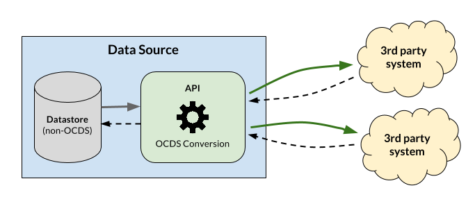
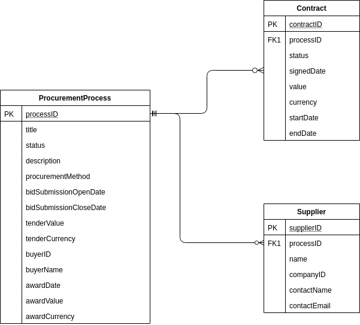

```{workedexample} 'Easy' Releases
:tags: release
```

# 'Easy' Releases

OCDS encourages the use of the [releases and records](../../primer/releases_and_records) model in order to publish up-to-date, timely data. However, sometimes publishers can't fully support the model, because historic data of contracting processes is not stored in the source system(s). In such case, the publisher can produce only one release for each contracting process, and the release gets overridden with new updates.

In this situation, it is possible to still meet OCDS requirements by following a strategy to build different release identifiers each time the data changes in a contracting process. Over the course of multiple updates, third parties would be able to build their own data store by periodically downloading or scraping the published data, and identifying the updates using release identifiers.

Here, two general approaches that a publisher can follow to renew release identifiers on each data update will be shown:

* **When the system saves a last modified date for entities** - use the dates to create a new release ID. This can be as simple as appending the date to the release identifier.
* **When the system does not contain a last modified date** - use a hash of all the fields to create a unique release ID. A hash is guaranteed to change when the data changes, and it is almost impossible for it to collide with a previous, existent identifier for the same contracting process.

See the examples below for more details.

These approaches can be useful for most situations but they are not meant to be the best solution for all cases. A publisher can find an alternative that works best for its own scenario.

## Additional Considerations

### Packaging

Releases in OCDS need to be packaged using a [release package](../../schema/release_package). This is to provide consistency and important metadata.

In an 'Easy' releases scenario it is still necessary to package data. Therefore the release needs to be wrapped in a *release package*. It is *not* appropriate to use an OCDS record to contain the release because `record.releases` is a list of all the releases and not just the latest one.

### Release tags

Releases in OCDS have a [release tag](../../schema/codelists.md#release-tag) which indicates the stage of the contracting process they relate to.

When producing a single release for each contracting process, we can't use any tags that need other tags to be present in previous releases, e.g. 'tenderUpdate' which follows the 'tender' tag. 

In this case, tags need to indicate the sections of the schema which are populated. For example, if a release provides data in the `tender`, `award`, and `contract` sections, the `tag` array would look like this:

```json
{
    "tag": [
      "tender",
      "award",
      "contract"
    ]
}
```

This makes more sense if we realize that a release is always the "first release" of a contracting process for an user that access the data for the first time. All sections contain new data, and the release needs a tag for each one.

## Worked examples

For the examples in the present section, the architecture in the image below is assumed.



Data is extracted from the source and transformed to OCDS each time there is a request, and resulting JSON files are not stored by the owner.

### Scenario 1: when a last modified date is stored

The sample database structure used for the present example is illustrated in the image below.


The 'ProcurementProcess' table contains one single row for each contracting process in the system, and the row is updated with each change. Contracts and suppliers are saved in separate tables. For both 'ProcurementProcess' and 'Contract' tables there is a `lastModifiedDate` column, with a timestamp of the last change made for the row.

The following steps show the progress in a single contracting process, and how the unique release identifier is built for each update.

#### 1. Tender initiation

The contracting process begins with a tender notice. The source tables contain the following data:

**ProcurementProcess**

```{csv-table-no-translate}
:header-rows: 1
:widths: auto
:file: ../../examples/easy_releases/worked_example1/tender_procurement_process.csv
```

There is no supplier or contract yet, so there are no entries for this contracting process in them. In this stage, the ocid is build by appending the value of the field `processID` to the ocid prefix ('ocds-213czf'), since `processID` is identifying uniquely each contracting process.

```json
{
    "ocid": "ocds-213czf-371630"
}
```

For the release ID, the value for `lastModifiedAt` is appended to the end of the ocid:

```json
{
    "id": "ocds-213czf-371630/2019-12-01T09:00:00Z"
}
```

It is possible to use the date alone as the release identifier, but prepending the ocid makes easier to differentiate releases from various processes in the same release package.

See the full JSON file below.

```{jsoninclude} ../../examples/easy_releases/worked_example1/tender.json
:jsonpointer:
:expand: releases,tender
```

#### 2. Tender update

The tender has been updated: the value increased slighly and the description has changed.

**ProcurementProcess**

```{csv-table-no-translate}
:header-rows: 1
:widths: auto
:file: ../../examples/easy_releases/worked_example1/tender_update_procurement_process.csv
```

The `lastModifiedDate` value has changed as well, therefore the value of the release identifier will change:

```json
{
    "id": "ocds-213czf-371630/2019-12-03T09:00:00Z"
}
```

See the full JSON below:

```{jsoninclude} ../../examples/easy_releases/worked_example1/tender_update.json
:jsonpointer:
:expand: releases,tag,tender
```

Note that the 'tag' field is still 'tender'. 

#### 3. Award

Now, the tender has been awarded. The related columns in 'ProcurementProcess' table have been populated and there is a new row in the 'Supplier' table for the process.

**ProcurementProcess**

```{csv-table-no-translate}
:header-rows: 1
:widths: auto
:file: ../../examples/easy_releases/worked_example1/award_procurement_process.csv
```

**Supplier**

```{csv-table-no-translate}
:header-rows: 1
:widths: auto
:file: ../../examples/easy_releases/worked_example1/award_supplier.csv
```

As the 'ProcurementProcess' table has been updated, the related release will have a new id:

```json
{
    "id": "ocds-213czf-371630/2019-12-14T14:42:00Z"
}
```

And the 'awards' section will be filled with the corresponding data. See the full JSON below.

```{jsoninclude} ../../examples/easy_releases/worked_example1/award.json
:jsonpointer:
:expand: releases,awards
```

Note that we are keeping the 'tender' tag from the previous step. 

#### 4. Contract

At the last stage there is a signed contract. The 'ProcurementProcess' table changes again to reflect the new stage, and a new entry is added in the 'Contract' table as shown below.

**ProcurementProcess**

```{csv-table-no-translate}
:header-rows: 1
:widths: auto
:file: ../../examples/easy_releases/worked_example1/contract_procurement_process.csv
```

**Contract**

```{csv-table-no-translate}
:header-rows: 1
:widths: auto
:file: ../../examples/easy_releases/worked_example1/contract.csv
```

A new release id is generated:

```json
{
    "id": "ocds-213czf-371630/2020-01-11T07:53:50Z"
}
```

See the full JSON below.

```{jsoninclude} ../../examples/easy_releases/worked_example1/contract.json
:jsonpointer:
:expand: releases,contracts
```

### Scenario 2: when a last modified date is NOT stored

This approach can be used when there is no last modified date in the source data. Below there is an updated image from the previous example:



The example is almost the same as the previous one, with the same steps, but with no last modified date in the tables as seen in the image above.

#### 1. Tender initiation

The example starts with the tender, and the following data in the 'ProcurementProcess' table:

**ProcurementProcess**

```{csv-table-no-translate}
:header-rows: 1
:widths: auto
:file: ../../examples/easy_releases/worked_example1/tender_procurement_process.csv
```

The unique identifier for this stage can be generated by joining all fields into a single string, and applying a hash function on it. Depending of tools and/or programming languages used in the transformation process, there can be many ways to achieve this task.  An example of how it can be done using a PostgreSQL query is shown below:

```sql
SELECT md5(CAST((p.*)AS text))
FROM ProcurementProcess p
WHERE p.processID = 371630
;
```

It is important to include *all* data fields that are included in OCDS data in the hash calculation. For the current row, the output value is `69a19ab9713d08bc7c54793144997d3a`. As the date field in the previous example, this will be appended at the end of the ocid:

```json
{
    "id": "ocds-213czf-371630/69a19ab9713d08bc7c54793144997d3a"
}
```

See the full JSON below.

```{jsoninclude} ../../examples/easy_releases/worked_example2/tender.json
:jsonpointer:
:expand: releases,tender
```

#### 2. Tender update

Now that tender data has changed: there are updates in the value and description fields.

**ProcurementProcess**

```{csv-table-no-translate}
:header-rows: 1
:widths: auto
:file: ../../examples/easy_releases/worked_example2/tender_update_procurement_process.csv
```

The same hash operation is repeated over the updated row and the resulting value is `957969e7458f5144a931d2feb452ea48`. The new release identifier is:

```json
{
    "id": "ocds-213czf-371630/957969e7458f5144a931d2feb452ea48"
}
```

See the full JSON below.

```{jsoninclude} ../../examples/easy_releases/worked_example2/tender_update.json
:jsonpointer:
:expand: releases,tag,tender
```

#### 3. Award

The tender has been awarded, therefore the 'ProcurementProcess' table has been updated and a new entry in the 'Supplier' table is included.

**ProcurementProcess**

```{csv-table-no-translate}
:header-rows: 1
:widths: auto
:file: ../../examples/easy_releases/worked_example2/award_procurement_process.csv
```

**Supplier**

```{csv-table-no-translate}
:header-rows: 1
:widths: auto
:file: ../../examples/easy_releases/worked_example2/award_supplier.csv
```

The new data in the 'Supplier' table can be included in the hash generation as well. In PostgreSQL, the previous sentence can be changed to include the 'Supplier' table as follows:

```sql
WITH data AS (
  SELECT * from ProcurementProcess
  JOIN Supplier on Supplier.processID = ProcurementProcess.processID
  WHERE processID = 371630
)

SELECT md5(CAST((data.*)AS text)) FROM data
;
```

The result of the query is `610d5900f947bcf67100449999ea49ce`, and the new release identifier is:

```json
{
    "id": "ocds-213czf-371630/610d5900f947bcf67100449999ea49ce"
}
```

See the full JSON below.

```{jsoninclude} ../../examples/easy_releases/worked_example2/award.json
:jsonpointer:
:expand: releases,awards
```

#### 4. Contract

In the last stage the contract is signed, the 'ProcurementProcess' table is updated and a new entry in the 'Contract' table is added.

**ProcurementProcess**

```{csv-table-no-translate}
:header-rows: 1
:widths: auto
:file: ../../examples/easy_releases/worked_example2/contract_procurement_process.csv
```

**Contract**

```{csv-table-no-translate}
:header-rows: 1
:widths: auto
:file: ../../examples/easy_releases/worked_example2/contract.csv
```

Since there is one more table involved ('Contract'), the *three tables* that store data for the full process can be used to calculate the hash. The previous SQL query can be changed again to include the 'Contract' table:

```sql
WITH data AS (
  SELECT * from ProcurementProcess
  JOIN Supplier on Supplier.processID = ProcurementProcess.processID
  JOIN Contract on Contract.processID = ProcurementProcess.processID
  WHERE processID = 371630
)

SELECT md5(CAST((data.*)AS text)) FROM data
;
```

Although it is true that the data in the 'Supplier' table has not changed in the last step, it ought to be included unless it is guaranteed that the data from the table does not change after a certain step in the process (with suppliers, this could be possible in some scenarios but that assumption is not taken here).

The new hash value is `1a87b0662990c66e140e62e813165107`, and the new release identifier is:

```json
{
    "id": "ocds-213czf-371630/1a87b0662990c66e140e62e813165107"
}
```

See the final JSON below.

```{jsoninclude} ../../examples/easy_releases/worked_example2/contract.json
:jsonpointer:
:expand: releases,contracts
```
