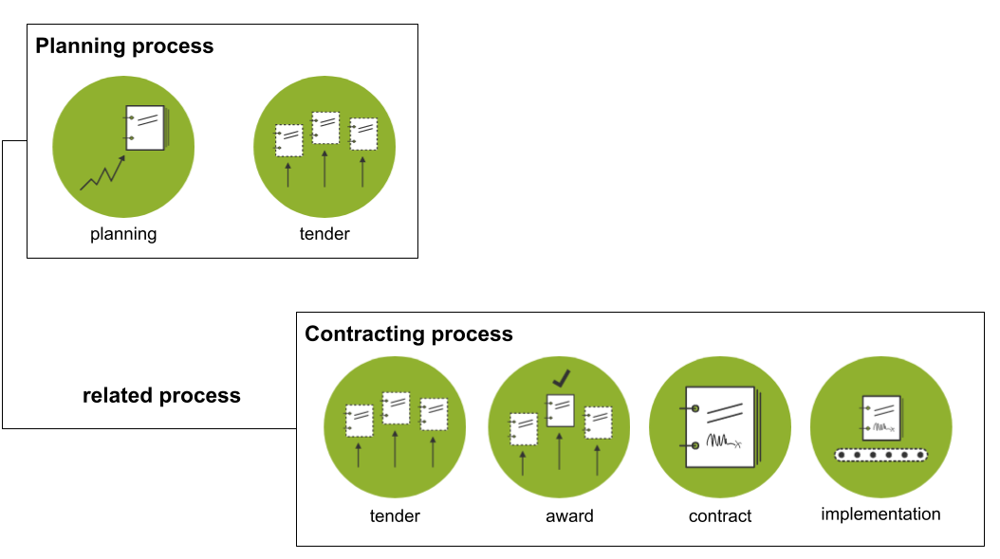

# Contracting processes and planning processes

There are two types of processes in OCDS: contracting processes and planning processes. Each process has a [unique contracting process identifier](https://standard.open-contracting.org/latest/en/schema/identifiers/#contracting-process-identifier-ocid) (`ocid`). This section helps map your contracting activities (most often procurement procedures) to the OCDS processes. 

OCDS defines a contracting process as:

> All the actions aimed at implementing one or more contracts. This covers tendering, awarding, contracting and implementation. It does not include actions linked to planning, as these are often less structured and may be linked to multiple contracting processes. In multiple stage procedures (e.g. framework agreements with reopening of competition), each round of competition is treated as a separate contracting process.

> Procedures that failed and were restarted are considered new processes.

> Boundaries between processes (e.g. whether two contracts result from a single process or from two processes) are set by buyers depending on their needs (e.g. efficient division of labor, clear communication with the market) and legislation (e.g. rules on using procedures and lots).

and a planning process as: 

> All the actions aimed at planning one or more contracting processes. This covers, for example, establishing the rationale for the procurement, giving the market a general description of the purchase, getting the necessary budget, forecasting and conducting market research.

> Planning processes are often less structured than contracting processes, so one or more planning process may end up leading to one or more contracting process.'

# _!!! TO-DO: Update the image below. Main point should be: planning and tender are part of planning processes, tender to implementation of contracting processes. I have removed the mentions of "initiating" from the text, so I suggest removing them from the image as well._  


The two processes should be linked together using the `relatedProcesses` array in the releases concerning the contracting process, with `.relationship` set to 'planning'. 

```{note}
When publishing data, we recommend separating data about the planning and contracting processes in line with the definitions above. However, publications of both planning and contracting data within a single contracting process continue to be conformant with OCDS 1.2 and earlier. Publishing this data in separate planning and contracting processes as requirement for conformity is being considered for a future, backwards uncompatible version of the standard ([GitHub issue](https://github.com/open-contracting/standard/issues/866)).
```

```{note}
Under OCDS 1.2 and earlier, it is not possible to publish all information about multi-stage procedures under a single contracting process. There is guidance on how to deal with this for [framework agreements guidance](https://standard.open-contracting.org/1.1/en/guidance/map/framework_agreements/) and [pre-qualification and pre-selection](https://standard.open-contracting.org/1.1/en/guidance/map/pre-qualification/). If you want to disclose this type of information (including other types of multi-stage procedures, such as competitive dialogues and innovation partnerships), contact the [helpdesk](../../support/index.md). The approach to modelling multi-stage procedures in a future, backwards uncompatible version of the standard is under discussion on [Github](https://github.com/open-contracting/standard/issues/440).
```
