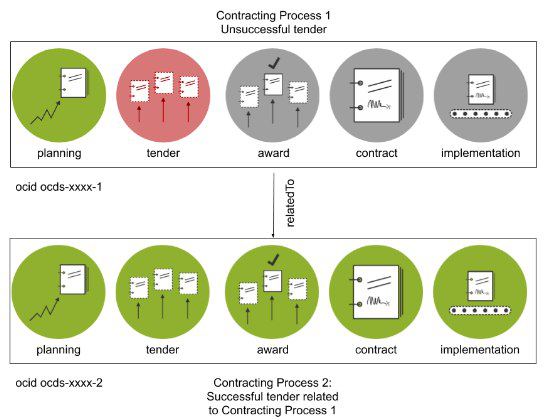

```{workedexample} Unsuccessful processes
:tags: tender
```

# Unsuccessful processes

In most jurisdictions, if a procedure is cancelled or unsuccessful, and a **new procedure** is started to procure the same items, the two procedures are considered two **different** contracting processes. This is in keeping with the OCDS definition of a contracting process.

However, in some jurisdictions, such as Paraguay, planning activity is considered as initiating the contracting process. Furthermore, if a first attempt is Unsuccessful in procuring items, the second attempt is considered to be part of the same contracting process. This differs from the OCDS definition of a contracting process. OCDS, instead, records the cancelled procedure in the `relatedProcesses` array of the new procedure, with the 'unsuccessfulProcess' code in the related process' `relationship` array.  



## Example: Modelling unsuccessful tenders in Paraguay

The [Sistema de Información de las Contrataciones Públicas (SICP)](https://contrataciones.gov.py/) discloses information about contracting processes for all public entities in Paraguay. SICP is managed by the National Directorate of Public Procurement (DNCP in Spanish).

The first data disclosed is about the planning process. Planning data includes an estimate of what an entity is going to buy, when and for how much. SICP assigns an `ocid` when the planning data is first disclosed, before the tender stage. In this example, the ocid is 'ocds-03ad3f-331547'.

```{jsoninclude} ../../examples/unsuccessful_tender/planning.json
:jsonpointer:
:expand: releases, planning
:title: unsuccessful-tender-planning
```

Next, the contracting process is disclosed, using a new `ocid`, 'ocds-03ad3f-331547-1'. The `relatedProcess` block links the planning process and the contracting process, with the relationship set to 'planning'.

The tender was unsuccessful, so the tender status is set to ‘unsuccessful’.

```{jsoninclude} ../../examples/unsuccessful_tender/tender.json
:jsonpointer:
:expand: releases, relatedProcesses, tender, status
:title: unsuccessful-tender-tender
```

The buyer issues another tender to buy the same item, following from the same planning process.

Paraguay considers the two tenders part of the same contracting process. But, in OCDS the two tenders are separate contracting processes.

To construct an `ocid` for the second contracting process, Paraguay adds a consecutive number to the `ocid` of the first process. In this example the new `ocid` is 'ocds-03ad3f-331547-2'

Paraguay could also have used the identifier for the second tender as the `ocid` for the second contracting process.

The `relatedProcesses` block links to the unsuccessful contracting process with the relationship set to ‘unsuccessfulProcess’, and to the initial planning process with the relationship set to ‘planning’.

```{jsoninclude} ../../examples/unsuccessful_tender/related_process.json
:jsonpointer:
:expand: releases, relatedProcesses, relationship
:title: unsuccessful-tender-related-process
```
