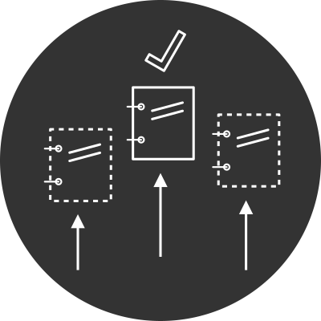

# Pre-qualification and pre-selection

Single stage procurement procedures, in which suppliers are invited to bid without submitting any prior information, are straightforward to model in OCDS.

However, many jurisdictions also use multi-stage procedures. Such procedures typically follow a process similar to:

```eval_rst
.. csv-table::
   :file: ../../examples/pre-qualification/multi-stage.csv
   :widths: 50,50
   :header-rows: 1
```

This worked example describes 3 types of multi-stage procurement procedures and explains how to model them in OCDS.

## Definitions

The term ‘pre-qualification’ is used to describe different types of procurement procedure:

### Pre-qualification with no limit on the number of qualified suppliers

The [UNCITRAL Model Law on Public Procurement (2011)](https://uncitral.un.org/en/texts/procurement/modellaw/public_procurement) was developed through extensive consultations with governments and interested international organizations and therefore reflects the procurement practices and concepts used in many different jurisdictions. The UNCITRAL model law defines pre-qualification as a procedure to:

> ...identify, prior to solicitation, suppliers or contractors that are qualified.

The model law states that an invitation to pre-qualify must be published, specifying the criteria and procedures for ascertaining the qualifications of suppliers or contractors and containing much of the information that would otherwise appear on an invitation to tender.

Once the qualifications of the suppliers or contracts have been assessed, only those that have been pre-qualified are entitled to participate further in the procurement proceedings.

```eval_rst
.. note::

   .. markdown::

      The European Union’s restricted procedure (see Article 28, [Directive 2014/24/EU](https://eur-lex.europa.eu/eli/dir/2014/24/oj)) is an example of a procurement procedure which uses pre-qualification.
```

### Pre-qualification with a limit on the number of qualified suppliers (pre-selection)

The UNCITRAL model law defines pre-selection as a procedure to:

> ...identify, prior to solicitation, a **limited number** of suppliers or contractors that best meet the qualification criteria for the procurement concerned.

Procedures using pre-selection follow the same process as those using pre-qualification, with the addition that the procuring entity must use the invitation to pre-qualify to disclose:

* The maximum number of pre-selected suppliers or contractors from which proposals will be requested.

* The manner in which the pre-selection will be carried out.

```eval_rst
.. note::

   .. markdown::

      The European Union’s restricted procedures, competitive procedures with negotiation, competitive dialog procedures and innovation partnerships all permit the use of pre-selection (see Article 65, [Directive 2014/24/EU](https://eur-lex.europa.eu/eli/dir/2014/24/oj))
```

### Pre-qualification in Paraguay

In Paraguay, a procuring entity can carry out a single pre-qualification for several tenders of the same nature (see article 22, [law Nº 2.051/03](https://www.contrataciones.gov.py/documentos/download/marco-legal/12760)). The details of this procedure will become clearer in the example below.

## The OCDS model

The OCDS contracting process model includes a single competitive stage (the `tender` section) representing the initiation of a contracting process, in which procuring entities invite submissions from potential suppliers:

<style><!--
.process-table { width:18%; float:left; font-size:10pt; }
.process-table p { font-size:10pt; text-align: center; }
.process-table img { width:80%; }
--></style>

<div style="width:100%">

<div class="process-table" markdown=1>


**Planning**

</div>

<div class="process-table" markdown=1>


**Initiation (Tender)**

</div>

<div class="process-table" markdown=1>



**Award**

</div>

<div class="process-table" markdown=1>


**Contract**

</div>

<div class="process-table" markdown=1>


**Implementation**

</div>

</div>
<br clear="all"/>

The `tender` section is also used to disclose information about the procedure used by the contracting process. In particular, the `tender.procurementMethod` field is used to classify the procedure used against the following codelist:

```eval_rst
.. csv-table-no-translate::
   :header-rows: 1
   :file: ../../../build/current_lang/codelists/method.csv
```

## Example: Pre-qualification

The Bank of England issues a [restricted procedure contract notice](https://ted.europa.eu/udl?uri=TED:NOTICE:90873-2019:TEXT:EN:HTML) to invite potential suppliers to pre-qualify to bid for a tender to provide facilities management services at its site in Roehampton.

Since this contract notice represents the initiation of the contracting process, it is modelled using the `tender` section in OCDS:

```eval_rst
.. jsoninclude:: ../../examples/pre-qualification/pre-qualification-package.json
   :jsonpointer: /releases/0/tender
   :title: Tender section

```

Although any potential supplier may submit a request to participate in the first stage, only qualified suppliers will be invited to submit a tender for the contract, so `tender/procurementMethod` is set to ‘selective’.

```eval_rst
.. note::

   .. markdown ::

      OCDS does not currently provide a means to disclose information on the second stage of multi-stage contracting processes. Possible approaches to modelling multi-stage contracting processes in OCDS are under discussion for inclusion in a future version of the standard ([Github issue](https://github.com/open-contracting/standard/issues/440)).

      Contact the [helpdesk](../../support/index.md) if you want to disclose this type of information.
```

## Example: Pre-selection

The National Nuclear Laboratory issues a [restricted procedure contract notice](https://ted.europa.eu/udl?uri=TED:NOTICE:28681-2020:TEXT:EN:HTML&src=0) to invite potential suppliers to pre-qualify for a project to update the physical security system arrangements at Preston Laboratory.

Since this contract notice represents the initiation of the contracting process, it is modelled using the `tender` section in OCDS.

As with the previous example, `tender/procurementMethod` is set to ‘selective’, since only qualified suppliers will be invited to submit a tender for the contract.

In addition, the criteria for choosing the limited number of candidates is disclosed using the [selectionCriteria extension](https://github.com/open-contracting-extensions/ocds_selectionCriteria_extension), developed for the OCDS for the EU profile:

```eval_rst
.. jsoninclude:: ../../examples/pre-qualification/pre-selection-package.json
   :jsonpointer: /releases/0/tender
   :title: Tender section

```

## Example: Pre-qualification in Paraguay

The Ministry of Public Works and Communications issues an [invitation for suppliers to pre-qualify for two tenders for consulting services related to road construction in two different groups of neighbourhoods](https://contrataciones.gov.py/licitaciones/convocatoria/338229-servicios-consultoria-estudios-factibilidad-diseno-final-ingenieria-tramos-caminos-1/precalificacion.html). Each tender will re-use the list of pre-qualified suppliers established as a result of this first procedure.

Since this invitation represents the initiation of a contracting process to establish a list of pre-qualified suppliers, it is modelled using the tender block in OCDS.

`tender.procurementMethod` is set to ‘selective’, since only qualified suppliers will be invited to bid in subsequent tenders that use the list.

```eval_rst
.. jsoninclude:: ../../examples/pre-qualification/pre-qualification-paraguay-package.json
   :jsonpointer: /releases/0/tender
   :title: Tender section

```

```eval_rst
.. note::

   .. markdown ::

      OCDS does not currently provide a means to disclose information on the second stage of multi-stage contracting processes. Possible approaches to modelling multi-stage contracting processes in OCDS are under discussion for inclusion in a future version of the standard ([Github issue](https://github.com/open-contracting/standard/issues/440)).

      Contact the [helpdesk](../../support/index.md) if you want to disclose this type of information.
```
