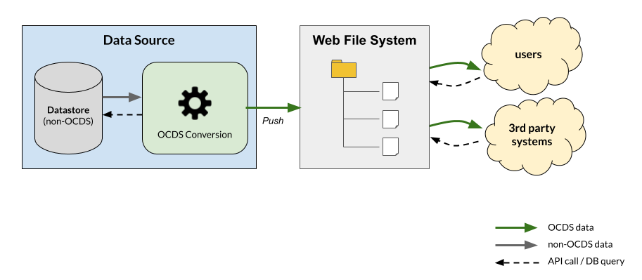
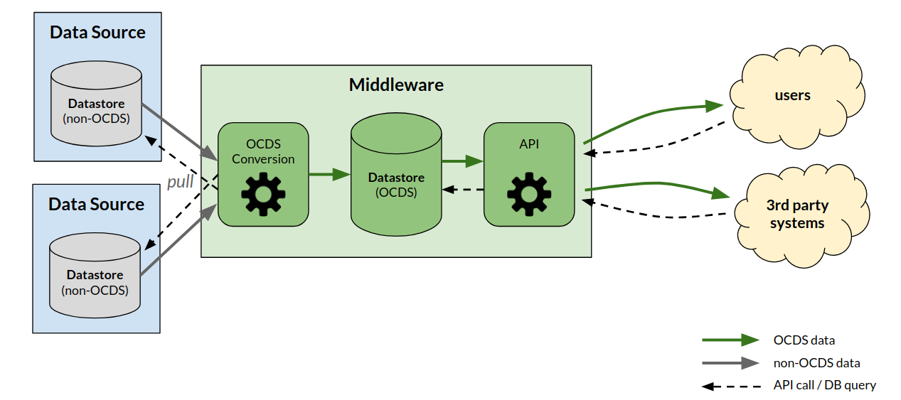
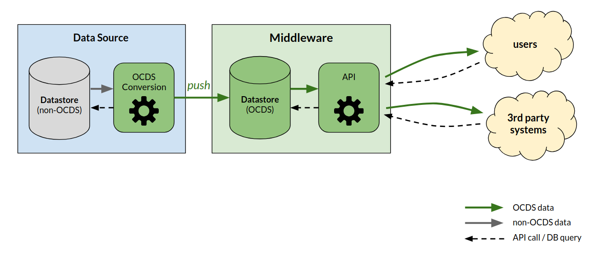
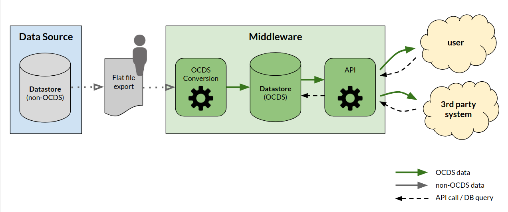

# System architectures

The publication of OCDS data typically requires the design of an architecture that extracts data from live systems, converts it to OCDS format and serves it to users and third party systems.

The design of an architecture depends on several factors:

* Whether existing systems will be modified, or a new system will be built,
* The number and nature of the live systems,
* The technical resources available to the publisher, like storage and processing capabilities, and the availability of technical personnel to maintain systems and modules.

In the ideal scenario:

* Individual releases and records for each contracting process should be available at unique persistent URLs;
* Bulk downloads in JSON, CSV (and, if appropriate, Excel) format should be available covering set periods of contracting;
* Users should be able to easily locate the collections of releases and records they want.

The following guidance describes some high-level approaches that can be used to publish OCDS data, with their advantages and disadvantages. These approaches are by no means an extensive or exclusive list, but can be used to inform the design of OCDS publication systems.

## On-demand transformation from live systems

In this scenario each originating system converts data directly in OCDS format on demand. Data is not stored according to OCDS but is converted each time the conversion process is invoked. This can be the easiest path when all contracting processes are managed by a single live system, although it requires modifications to the original system to add an OCDS conversion module.

One approach in this scenario is to write to a web-accessible file system, as illustrated below, and update it periodically by invoking the conversion module.

Another one is to implement an API, which performs data transformation on the fly, each time a request is received.

In both alternatives, the OCDS Conversion module produces OCDS releases and/or records, wrapped in release/record packages.

The file system approach ensures that each OCDS document can be accessed through a persistent URL, but the volume of data can grow quickly as plain files can take significant space. Bulk downloads can be generated periodically and stored in the file system.

The API approach does not require additional storage space, but it may be not possible to provide persistent URLs for individual releases. Bulk downloads can be provided as part of the API, although it may stress the live systems with large data queries.

Another potential issue for both approaches is that a change history can be published **only** if the live system stores the change history for contracting processes. 

The Easy releases guidance explains how to achieve a conformant OCDS implementation where it is not possible to provide a full change history.

## Separate OCDS datastore

In the scenarios that follow, data is converted to and stored in OCDS format. This has some advantages:

* Data from multiple systems can be merged and centralized in a single datastore;
* It may relieve live systems from expensive queries;
* It may enable the generation of the change history for each contracting process;

These benefits should be balanced against the cost of maintaining a separate datastore. In these scenarios, an API is assumed to provide access to OCDS data.

Publishers should consider how to store OCDS data. Releases are immutable so can be stored as they are, but as records change over time, they can either be built on each API call or stored in the database and updated each time a new release is published. OCDS data needs to be published in either a release or record package which can be generated for each API call.

The change history guidance and worked example describes OCDS releases and records and their different components.

### Pull and convert

In this scenario a middleware system sits between live systems and the internet facing API. An automated process periodically pulls data from live systems to the middleware system which performs the conversion to OCDS and maintains a datastore in OCDS format.

The key benefit of this approach is that the middleware system can store a change history, even where this is not maintained in individual source systems.

This approach requires limited modification to live systems, to enable the middleware to pull data. The OCDS Conversion module can merge data from different systems (e.g. when data is extracted from a procurement system and a financial system). To add further source systems, the OCDS conversion element of the middleware needs to be updated to pull data from the new system and convert it to OCDS.

An important decision in the implementation of such a system is how frequently to pull data from the source systems. If data is pulled infrequently there is a risk that the detail of individual changes may be lost.

An alternative to the pull mechanism is to implement a push mechanism in each source system, triggered by specific events or changes to the data. This approach can mitigate the risk of individual changes being lost, however it may require more modifications to the source system.

A similar approach has been adopted by European Dynamics to support OCDS output from a new e-procurement system for the Zambian Public Procurement Agency.

### Convert and push

This scenario can be viewed as a combination of the two previous scenarios. Live systems perform the conversion of data to OCDS format and push this to a middleware system which maintains an OCDS format datastore and an internet facing API.

Although this approach puts the burden of data conversion in live systems, it may be an appropriate solution for publishers that have a single source system which does not maintain a change history.

This approach may also be suitable where data from many source systems needs to be combined. Each system can effectively become an OCDS publisher, whilst the middleware requires less complexity, since it need only ingest data in a single format.

A similar approach has been adopted by the [OpenProcurement](http://openprocurement.org/en/) system, developed in Ukraine and used as the basis for the [Prozorro](https://prozorro.gov.ua/en/) platform, which uses OCDS building blocks as the foundation for live systems data models, easing the conversion process. 

### Manual import

In this scenario a middleware system sits between live systems and the internet facing API.

Data is manually exported from live systems for upload to the middleware system which performs conversion to OCDS and maintains a datastore in OCDS format.

A disadvantage in this approach is the potential of failures, when input files may be corrupted or have unexpected formats due to changes or errors in the live systems.

There’s a well documented example of this approach from the work Development Gateway have been [carrying out in Vietnam](https://www.developmentgateway.org/blog/under-hood-open-source-dashboard-procurement-vietnam).

## Additional considerations

When designing an architecture, publishers should consider the following:

* **Search endpoints**. An API can provide more than individual releases and records. Endpoints can be provided to filter contracting processes by different criteria, like product types, suppliers and procuring agencies. Another consideration is providing alternative formats, like CSV and Excel data for users who are more familiar with spreadsheets.
* **Documents**. OCDS includes the disclosure of documents. In many cases systems link out to documents on external platforms, where link-rot can quickly set-in. The best systems will ensure that documents are archived, and kept available permanently.
